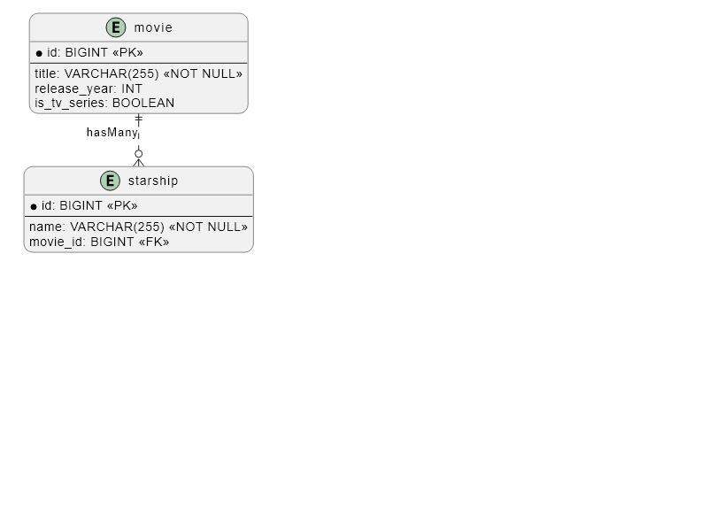

# Starship Registry

A Spring Boot demostration project for managing movies starship registrations and information.

## Requirements

- Java 21
- Maven
- Docker and Docker Compose

## Tech Stack

- **Framework**: Spring Boot 3.4.3
- **Data**: JPA, Redis (caching), RabbitMQ (messaging)
- **Database**: H2 (dev), Flyway (easier to maintain DDL scripts)
- **Tools**: Lombok, Karate (integration tests)
- **Security**: Keycloak

## Architecture

This project follows the Hexagonal Architecture pattern:

```
                     ┌─────────────────────────┐
                     │                         │
                     │       Core Layer        │
                     │ (Use cases, Domain      │
                     │  Business Logic)        │
                     └───────────┬─────────────┘
                                 │
                                 │
          ┌────────────────────────────────────────┐
          │                                        │
┌─────────┴──────────┐                ┌────────────┴─────────┐
│                    │                │                      │
│   Inbound Ports    │                │     Outbound Ports   │
│   (Application     │                │     (Repository      │
│    Services)       │                │      Interfaces)     │
│                    │                │                      │
└─────────┬──────────┘                └────────────┬─────────┘
          │                                        │
          │                                        │
┌─────────┴──────────┐                ┌────────────┴─────────┐
│                    │                │                      │
│  Inbound Adapters  │                │   Outbound Adapters  │
│  (REST Controller, │                │   (JPA Repository,   │
│   RabbitMQ         │                │    Redis, etc.)      │
│   Consumer)        │                │                      │
│                    │                │                      │
└────────────────────┘                └──────────────────────┘
```

## Features

- RESTful API for starship management with authentication
- Caching and message queue integration
- Health monitoring and metrics

## Building and Running

### Build the project

```bash
mvn clean install
```

### Run the application

```bash
mvn spring-boot:run
```

### Run with Docker Compose

```bash
docker-compose up -d
```

This will start:
- The Starship Registry application
- Redis for caching
- RabbitMQ for messaging
- Keycloak for authentication
- Apigateway for secure access

### Run unit tests and integration tests

```bash
mvn test          # Unit tests
mvn verify        # Integration tests
mvn test -Dtest=KarateTestRunner -Dkarate.options=classpath:karate/starship-adding-karate.feature:24 # Example Specific case Integration, tests file: starship-adding-karate.feature, case line: 24
```

## Run with Docker
```
docker build --pull --rm -f dockerfile -t starshipregistry:latest .
docker run -p 8081:8081 starshipregistry:latest
```

## Running External Services

### Running Redis

The application uses Redis for caching. If you have Docker installed, you can start a Redis container with the following command:

```bash
docker run --name redis -p 6379:6379 -d redis
```

This will start a Redis server on `localhost:6379`.

### Running RabbitMQ

The application integrates with RabbitMQ for message queuing. You can start RabbitMQ using Docker:

```bash
docker run -d --hostname rabbitmq --name rabbitmq -p 5672:5672 -p 15672:15672 rabbitmq:management
```

### Verifying Redis and RabbitMQ

You can verify that Redis and RabbitMQ are running correctly:

- For Redis:
  ```bash
  redis-cli ping
  ```
  If Redis is running, it will respond with:
  ```
  PONG
  ```

- For RabbitMQ:
  Open the management console at `http://localhost:15672` and log in with the default credentials (`admin` / `admin123`).

### Manage Database

Open the management console at http://localhost:8081/starship-registry/v1/h2-console

### keycloak Required Configuration

Open the management console at http://localhost:8080/admin
- User/pass: admin/admin123

- Create Realm: Starship-registry
- Create client: 
  - Client ID: api-gateway
  - Credetials: Regenerate Client secret (client_secret)
- Create User:
    - Username: user (username)
    - Credentials: set password user123 (password) temporary off

Execution request example:
```
###
# keycloak login
POST http://localhost:8080/realms/starship-registry/protocol/openid-connect/token
Content-Type:application/x-www-form-urlencoded

grant_type=password&client_id=api-gateway&username=user&password=user123&client_secret=uczeS2BlcYNdcLmaOEv8vcQaqxwc10du

####
# find by id
GET http://{{host}}/{{contextPath}}/starships/2
Authorization: Bearer {{keycloakToken.response.body.access_token}}
```

## Database diagram


## Secuence diagrams 
- [starship-finder](doc/bdd-specs/starship-finder.png)

- [starship-adding](doc/bdd-specs/starship-adding.png)

- [starship-remover](doc/bdd-specs/starship-remover.png)

- [starship-modifier](doc/bdd-specs/starship-modifier.png)

## Endpoints
- [starship-registry](doc/endpoints/starship-registry.http)
- [apigateway](apigateway/endpoints/apigateway.http)

## Useful Resources

- [Spring Boot Documentation](https://docs.spring.io/spring-boot/docs/current/reference/html/)
- [Redis Documentation](https://redis.io/documentation)
- [RabbitMQ Documentation](https://www.rabbitmq.com/documentation.html)
- [Keycloak Documentation](https://www.keycloak.org/documentation)
